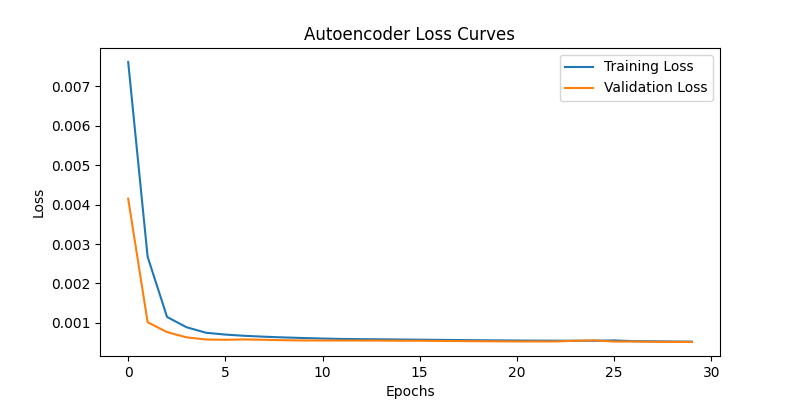
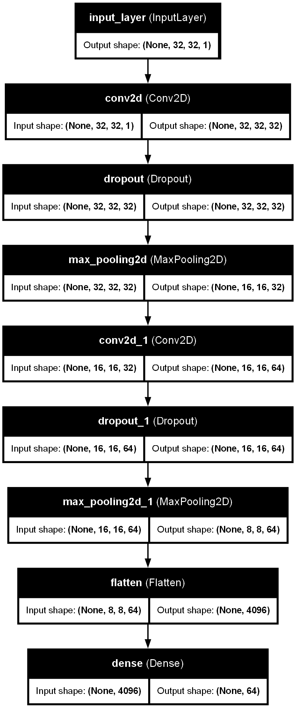
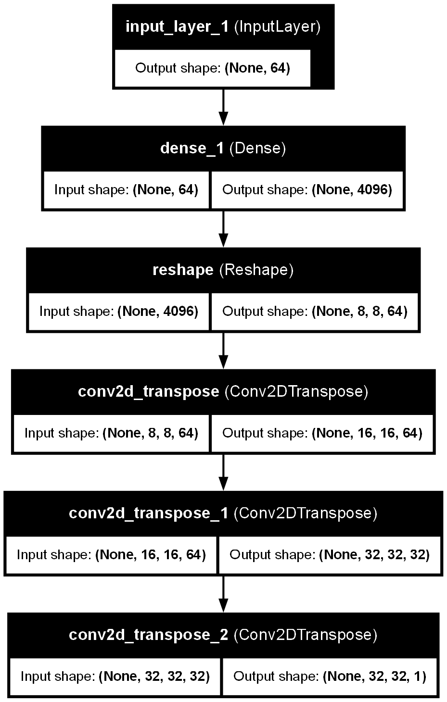
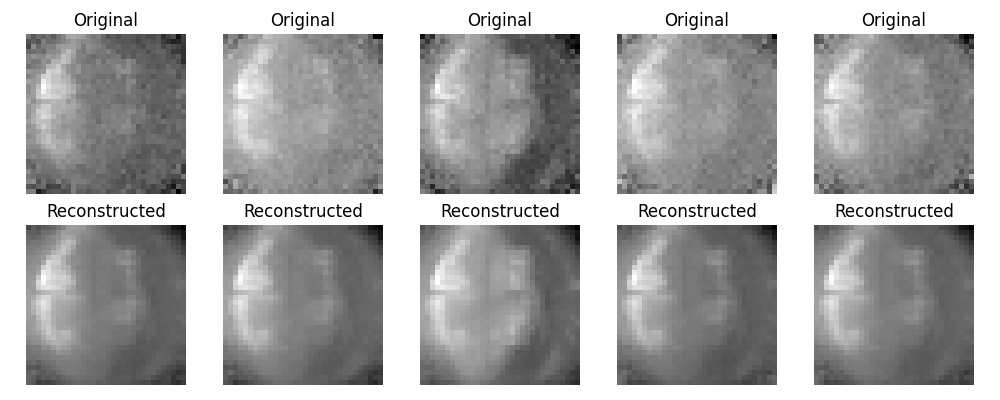
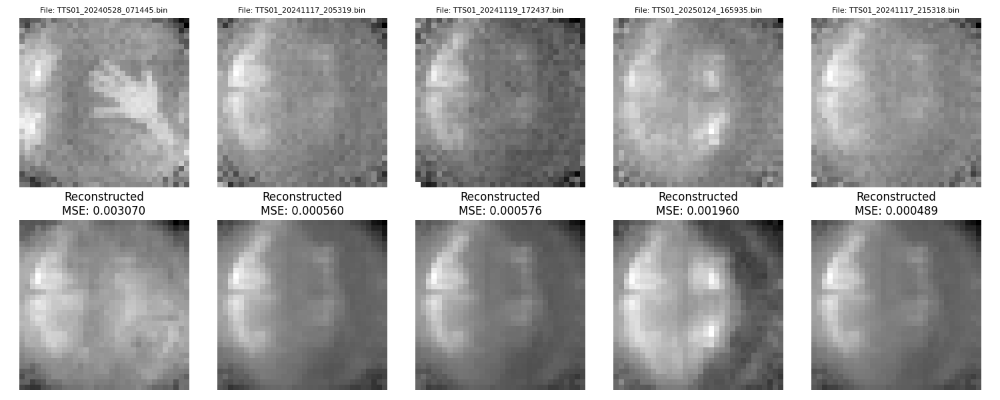
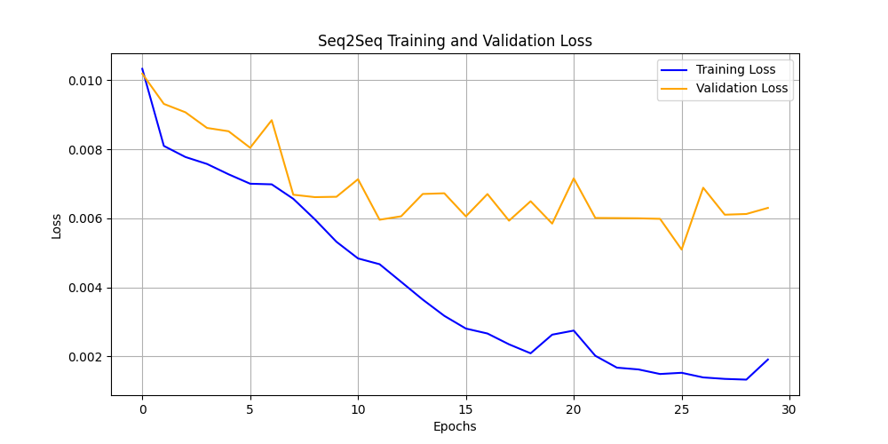
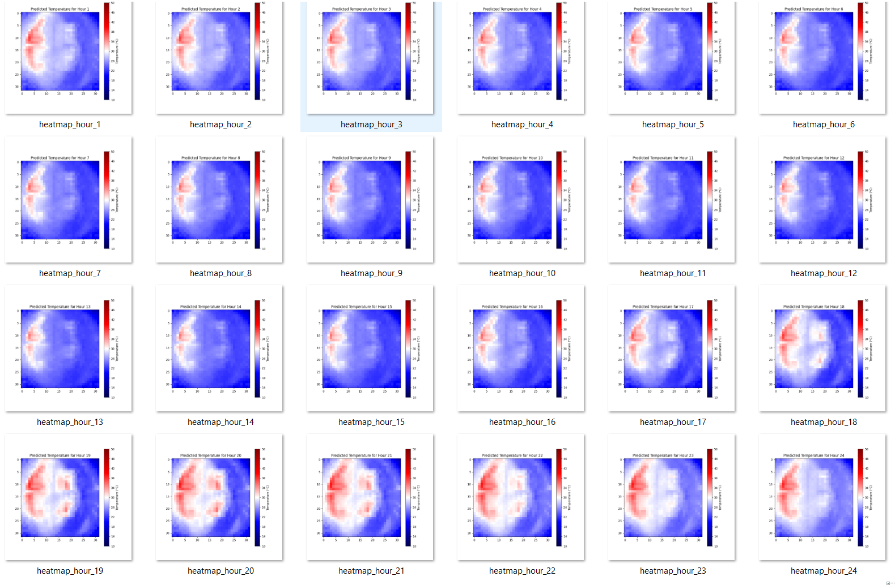
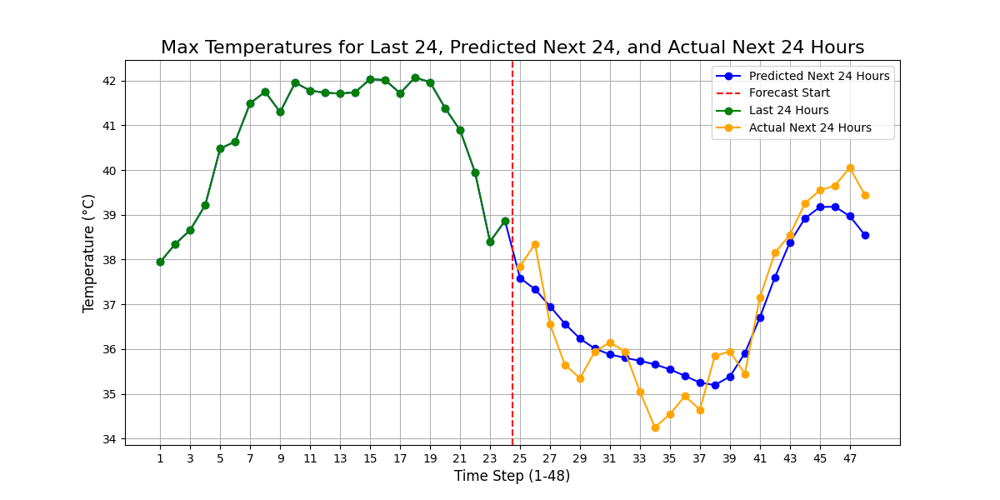
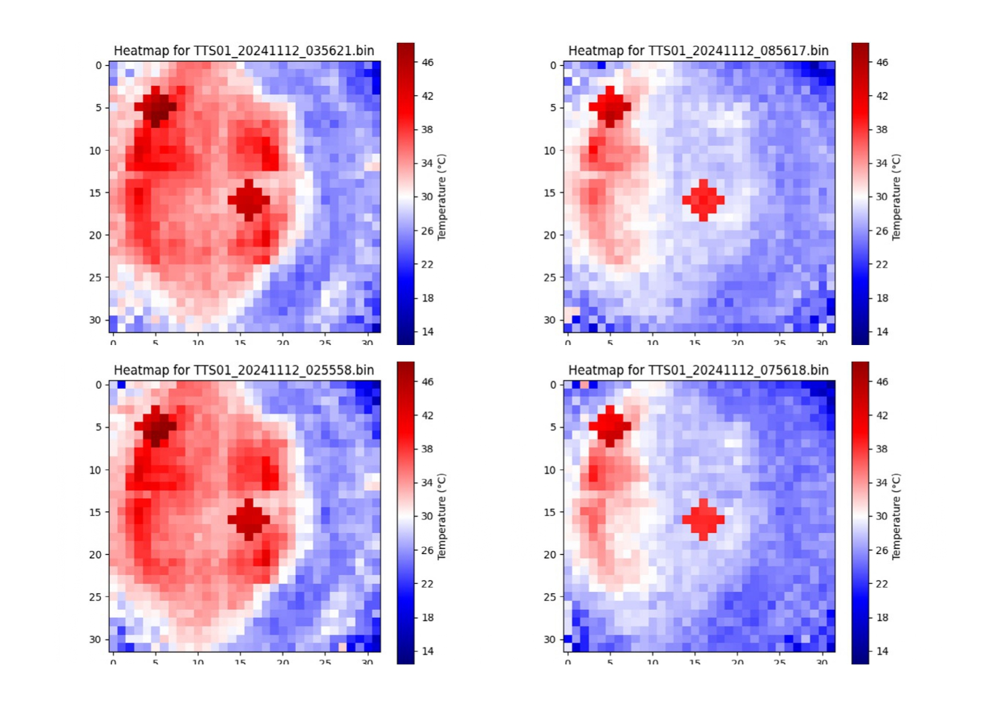
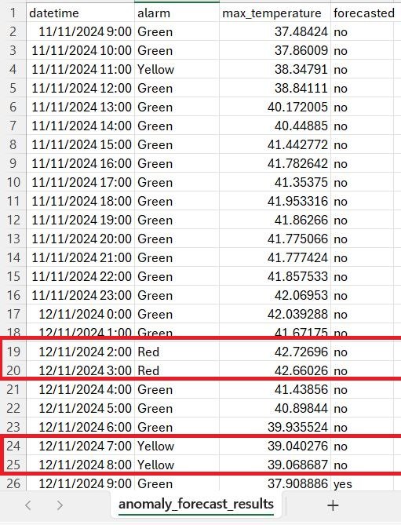

# Panel360 Autoencoder & LSTM Seq2Seq Documentation

This document provides an overview of the results and outputs of the Convolutional Autoencoder and LSTM Seq2Seq models for image reconstruction and sequence forecasting. Below are the key visualizations and descriptions of the training, architecture, and performance evaluation.

## 1. Dataset Overview

- Training Dataset: TTS01_20241013_003835 to TTS01_20241112_085617(The dataset contains 721 thermal images collected every 1 Hour.)

- Input Data: 32×32 thermal images

- Objective:

   - Autoencoder: Extracts compressed feature representations from 32×32 thermal images and reconstructs them with minimal loss.

  - LSTM Seq2Seq: Learns temporal dependencies in thermal patterns to forecast future distributions for predictive maintenance.

## 2. Convolutional Autoencoder (CAE)

### 2.1 **Loss vs. Epochs**
   - **Description**: This plot demonstrates the training and validation loss of the autoencoder model over multiple epochs.
    
     

### 2.2 **Encoder Architecture**
   - **Description**: Visual representation of the encoder model architecture, showcasing its layer structure, input shapes, and output shapes.

     

### 2.3 **Decoder Architecture**
   - **Description**: Visual representation of the decoder model architecture, including layer types, input shapes, and output shapes.
    
     

### 2.4 **CNN Autoencoder Hyperparameters and Parameters**
   - **Hyperparameters**:
     - Latent Space Dimension: 64
     - Dropout Rate: 0.1
     - Activation Function: ReLU (for convolution layers), Sigmoid (for output layer)
     - Learning Rate: 0.0005
     - Batch Size: 8
     - Optimizer: Adam

   - **Encoder Parameters**:
     - Total Parameters: 281,024
     - Trainable Parameters: 281,024
     - Non-trainable Parameters: 0
   
   - **Decoder Parameters**:
     - Total Parameters: 321,921
     - Trainable Parameters: 321,921
     - Non-trainable Parameters: 0

### 2.5 **Original vs. Reconstructed Images**
   - **Description**: Comparison of original input images and their reconstructed outputs by the autoencoder on the training set.
    
     

### 2.6 **Test Reconstruction**
   - **Description**: Visualization of test set samples, showing original images and their reconstructed counterparts.
    
     

### 2.7 **Observations**
  - The loss curve indicates that the model converges effectively.
  - The reconstructed images closely resemble the originals, highlighting the ability of the autoencoder to capture key features.
  - The autoencoder struggles to reconstruct test images containing occlusions (e.g., a hand in the image), indicating a sensitivity to unexpected distortions.

## 3. LSTM Seq2Seq Model (Time-Series thermal images Forecasting)

The LSTM Sequence-to-Sequence (Seq2Seq) model is trained to predict future thermal images based on historical data.

### 3.1 **Loss vs. Epochs**
   - **Description**: This plot demonstrates the training and validation loss of the LSTM Seq2Seq model over multiple epochs.
    
     

### 3.2 **Forecasted 24-hour**
   - **Description**: The model predicts thermal distributions for the next 24 hours using input data from the past 7 days. These heatmaps represent the expected spatial temperature variations.
    
     

### 3.3 **Forecasted 24-hour maximum temperature vs. Ground Truth**
   - **Description**: This graph compares predicted vs. actual maximum temperatures for the next 24 hours. The blue line represents model forecasts, while the orange line shows actual observed values. A stable trend indicates a strong correlation between predictions and real-world data.
    
     

### 3.4 **LSTM Seq2Seq Hyperparameters and Parameters**
   - **Hyperparameters**:
     - Latent Space Dimension: 64
     - LSTM Layers: 1
     - LSTM Units: 96
     - Learning Rate: 0.001
     - Dropout: 0.2
     - Batch Size: 8

   - **Model Parameters**:
     - Total Parameters: 142,144
     - Trainable Parameters: 142,144
     - Non-trainable Parameters: 0
    
## 4. Anomaly Detection & Analysis (Isolation Forest)

The Isolation Forest model is trained on the latent vectors obtained from the autoencoder. It detects anomalous thermal patterns in the last 24 hours of observed data and the next 24 hours of forecasted images.

### 4.1 **Synthetic Heatpatch Injection for Anomaly Testing**
   - **Description**:To validate anomaly detection capabilities, synthetic heat patches were added to specific thermal images, simulating overheating or foreign heat sources..
   Methodology: Circular patches with a radius of 2 pixels and amplitude of +10°C were injected.
    
     

### 4.2 **Anomaly Detection Results**
   - **Description**: The anomaly detection results highlight deviations from normal temperature patterns, flagged by the Isolation Forest. The exported CSV provides timestamped anomaly alerts for further analysis.
    
     

---